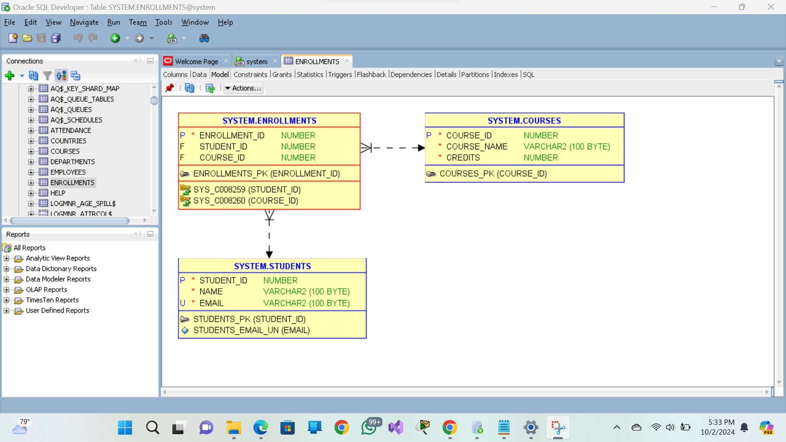

# introduction 
MY  README file involves creating a database with the necessary sql operation involves several steps, from designing the schema to performing various sql operations (DDL,DML,DCL,TCL). here'a step-by step guide to achieve this for an oracle database system .
# conceptual diagram 
Let's consider a simple system management schema for a university system with the following entities:
1, Students
2, Courses
3, Enrollments (to manage the many-to-many relationship between students and courses)
Relationships
A Student can enroll in multiple Courses (one-to-many).
A Course can have multiple Students (many-to-many).
The Enrollments table will represent the many-to-many relationship.
# create tables --
# Create Students table
```sql
CREATE TABLE Students (
    student_id NUMBER PRIMARY KEY,
    name VARCHAR2(100) NOT NULL,
    email VARCHAR2(100) UNIQUE NOT NULL
);
```

# Create Courses table
```sql
CREATE TABLE Courses (
    course_id NUMBER PRIMARY KEY,
    course_name VARCHAR2(100) NOT NULL,
    credits NUMBER NOT NULL
);
```
 # Create Enrollments table
 ```sql
CREATE TABLE Enrollments (
    enrollment_id NUMBER PRIMARY KEY,
    student_id NUMBER REFERENCES Students(student_id),
    course_id NUMBER REFERENCES Courses(course_id)
);
```
# DML operations (INSERT, UPDATE, DELETE).
## Insert data into Students
```sql
INSERT INTO Students (student_id, name, email) VALUES (1, 'Alice Johnson', 'alice.johnson@example.com');
INSERT INTO Students (student_id, name, email) VALUES (2, 'Bob Smith', 'bob.smith@example.com');
```

## Insert data into Courses
```sql
INSERT INTO Courses (course_id, course_name, credits) VALUES (101, 'Database Systems', 3);
INSERT INTO Courses (course_id, course_name, credits) VALUES (102, 'Data Structures', 4);
```

## Insert data into Enrollments
```sql
INSERT INTO Enrollments (enrollment_id, student_id, course_id) VALUES (1, 1, 101);
INSERT INTO Enrollments (enrollment_id, student_id, course_id) VALUES (2, 1, 102);
INSERT INTO Enrollments (enrollment_id, student_id, course_id) VALUES (3, 2, 101);
```

# Update a student's email
```sql
UPDATE Students SET email = 'alice.newemail@example.com' WHERE student_id = 1;
```
# Delete a course
```sql
DELETE FROM Courses WHERE course_id = 102;
```
# Perform Joins to Retrieve Related Data
```sql
SELECT s.name AS student_name, c.course_name
FROM Students s
JOIN Enrollments e ON s.student_id = e.student_id
JOIN Courses c ON e.course_id = c.course_id;
```
# Retrieve courses along with the number of students enrolled
```sql
SELECT c.course_name, COUNT(e.student_id) AS number_of_students
FROM Courses c
LEFT JOIN Enrollments e ON c.course_id = e.course_id
GROUP BY c.course_name;
```
# Example of DCL and TCL Operations
```sql
-- Grant SELECT permission to a user
GRANT SELECT ON Students TO username;

-- Rollback a transaction (if needed)
ROLLBACK; -- Assuming a previous transaction was made but needs to be undone
```
# relationship shown in the tables created



# conclusion 
This guide provides a comprehensive overview of how to design a simple Oracle Database schema, create tables, manipulate data, and perform queries using SQL. Adjust the schema and commands as necessary to fit your specific requirements! If you have any more specific requirements or questions, feel free to ask!


